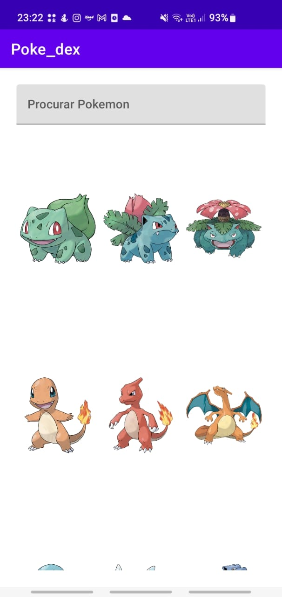
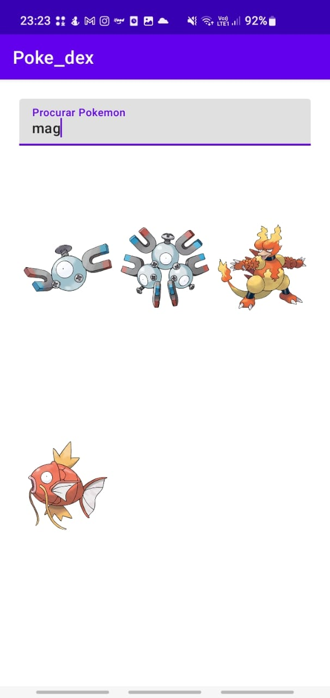
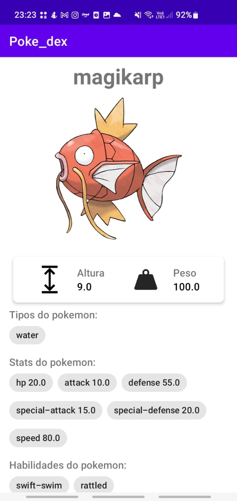

## PokeDex
Atividade realizada na disciplina de desenvolvimento móvel

## Sobre o projeto
Consumindo a API RESTful <a href="https://pokeapi.co/">PokéApi</a> para adquirir dados dos pokemons, o projeto mostra de forma organizada pokemons e seus respectivos status e imagens.

## Conteúdos

- Projeto android desenvolvido em Kotlin
- Realizando requisições com uso da biblioteca httpClient retrofit2
- Serialização dos dados das requisições com uso da biblioteca GSON (transformando JSON em POJO)
- Carregando imagens com o uso da biblioteca Picasso
- Utilizando pattern adapter para inserção dos pokemons na RecyclerView
- Utilizando componentes de layout do android como RecyclerViews, LinearLayout, ConstraintLayout e NestedScrollView
- Estrutura de projeto MVC

### Navegando pelo App

### Pesquisando por um pokemon

### Mostrando dados do pokemon

